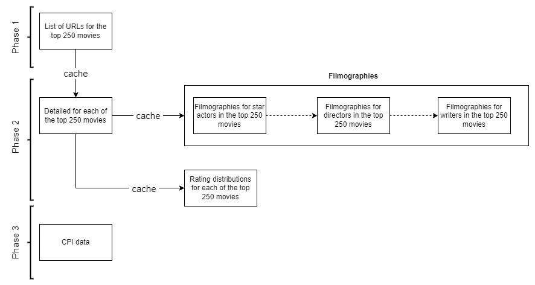
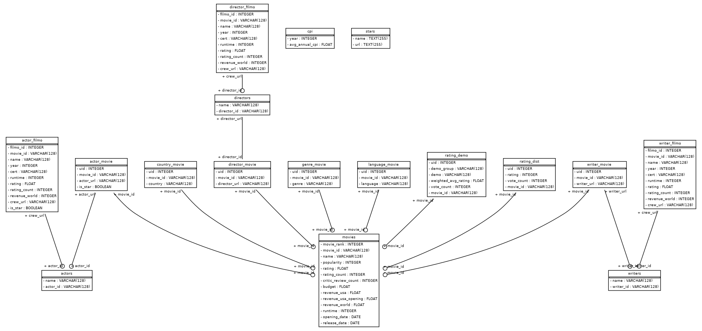

\tableofcontents

# Introduction

This is the documentation for the [IMDB top 250](https://www.imdb.com/chart/top) crawler. Due to time constraint, the solution built here are limited in some aspect. In the __Discussion__ sections, I raise some concerns regarding my solution (in terms of code and logic), and discuss ways to address these concerns.

# Usage

## Installation

To crawl data and reproduce the analysis, the following packages must be installed:

- numpy
- pandas
- scipy
- scikit-learn
- statsmodels
- beautifulsoup4
- matplotlib
- streamlit
- seaborn
- altair
- SQLAlchemy
- tqdm
- sqlalchemy_schemadisplay

These packages can be installed by running:

```bash
pip install -r requirements.txt
```

The code is written with Python 3.8. As such, please use the same version of Python to guarantee reproducibility. Use `venv` or `conda` to create a new environment for isolation.

## Crawler

### Running from CLI

To crawl data, run the `crawl.py` script: 

```bash
python crawl.py
```

Arguments can also specified as follows:

- `--page=`: Can be one of the following: 
    - `movie`: Crawl top 250 movie information.
    - `rating`: Crawl rating distribution tables for each movie above.
    - `actor_filmo`: Crawl the top 50 most voted movies in the filmographies of all the stars (actors/actresses) in the top 250 movies.
    - `director_filmo`: Crawl the top 50 most voted movies in the filmographies of all the directors in the top 250 movies.
    - `writer_filmo`: Crawl the top 50 most voted movies in the filmographies of all the writers in the top 250 movies.
    - `filmo`: Crawl the 3 items above, i.e. actor filmography, director filmography and writer filmography.
    - `cpi`: Crawl CPI data upto 2022 to adjust dollar amounts for inflation.

- `--stop_at=`: Take an integer to specify at which index to stop crawling. Use this to test the script (e.g. `--stop_at=5`) without having to crawl all 250 movies.

Note that running the script without any arguments will crawl everything.
For example:

- Crawl everything:
```bash
python crawl.py
```

- Crawl everything:
```bash
python crawl.py --page=all
```

- Crawl everything, stop at 5 items per group.
```bash
python crawl.py --page=all
```

- Crawl movies only, stop at 5 first movies.
```bash
python crawl.py --page=movie --stop_at=5
```

### Code logic

#### Crawling pipeline


{ height=340px }


The crawler can be broken down into phases and subprocesses, as illustrated above.

- Phase 1: Get the URLs of all 250 movies from the IMDB top 250 page.
- Phase 2: Using the URL of each movie, get the detailed information in its page. Some extra information, such a        s detailed rating distribution requires going further into another level of sub-URL to crawl. Filmographies of actors, directors and writers are also scraped, but only the top 50 movies with the most votes (which is the first page of the search result). 
- Phase 3: Get CPI data, which will be used later to adjust for inflation for dollar values.

Each subprocess use the output (cache) from the previous one (when linked with an arrow labeled with "cache") to crawl data.


#### Base crawler classes

The crawler use 2 abstract base classes: `BaseCrawler` and `BaseBulkCrawler`. All other classes inherit from these two.

##### BaseCrawler

The `BaseCrawler` class contains the following default methods:

```python
class BaseCrawler(ABC):
    @abstractmethod
    def __init__(self):
        pass

    def get_soup(self, path_url):
        return get_soup(path_url=path_url)

    @abstractmethod
    def crawl(self) -> pd.DataFrame:
        pass

    def save_cache(
        self, crawler_output, 
        file_name: Union[List, str] = None
    ):
        ...
```

Classes inherited from the `BaseCrawler` class will also have the `crawl()` method, which can be used to crawl data from a single URL.

##### BulkCrawler

The `BaseBulkCrawler` class contains the following default methods:

```python
class BaseBulkCrawler(BaseCrawler):
    @abstractmethod
    def __init__(
        self, url, 
        load_from_cache: bool = True, 
        stop_at: int = None
    ):
        # raise NotImplementedError
        self.stop_at = stop_at

    def bulk_craw(
        self, CrawlerObject, 
        write_to_cache: bool = True, 
        file_name: str = None
    ):
        ....

    @abstractmethod
    def crawl(self, crawler, index, 
        status: bool = True
    ):
        pass
```

Classes inherited from the `BaseBulkCrawler` class will have the `bulk_craw()` method, which can be used to crawl data from multiple URLs. This method is shared between child classes and does not have to be redefined.

Note that the `BaseBulkCrawler` inherits from the `BaseCrawler` class, which means it will have the `save_cache` method.


#### Caching

Data crawled from IMDB are saved in the "./cache" folder. The folder is created automatically if not exists. Subsequent crawling processes use caches from the previous process. If the cache does not exists, the process will attempt to trigger its immediate prior process.

Caches are also used as source to create database (See __Database__ section below).

#### Exception handling

As with most other crawlers/scrapers, crawling data from IMDB is subjected to many types of exceptions and errors. The most common one are:

- __Timeout Exception__: This usually happens when the crawler makes too many requests to the website in a short amount of time. To handle this exception, a `INTERVAL_DELAY` variable is used to specify an amount is seconds to wait before making another request. Moreover, a `MAX_RETRY` variable is also used to specify the number of time that the crawler would retry crawling *failed* items before stopping. These variables can be changed in `src.config`. When the number of max retry is reached without success, the program will fail.

- Element not found, which can result in `AttributeError` or `IndexError`. These exceptions happen when crawling a single element/feature of an entity (movie, rating, filmography, etc.), and as such would immediately result in no data being returned (`None`), instead of triggering retrial attempts. Exceptions (and the index they happen at) are printed to stdout and to log file.

## Database

A small database is implemented using SQLite, while the schemas is managed with SQLAlchemy.

### Schema

The schema of the database can be visualized as below:

{ height=340px }

### Running from CLI

To create a database, run the following script:

```bash
python to_db.py
```

This script automatically drop all own tables from the database (and create the database if not exists), use the schemas define in `src.database.models` and insert data from cache.

# Discussion

Due to time constraint, the crawler is still lacking in some of the following aspects:

- __There are some potentially useful data that has not yet been crawled__, such as the dates of birth of actors, directors and writers. This can be used to calculate the age at which that person was involved with a particular movie. Some other information includes: 
    - Awards (winners and nominations), 
    - More pages in the filmography search results, 
    - Agencies and production companies related to a movie.

- __The crawler does not insert to database immediately after finishing crawling data__. I separate these two processes for ease of testing.